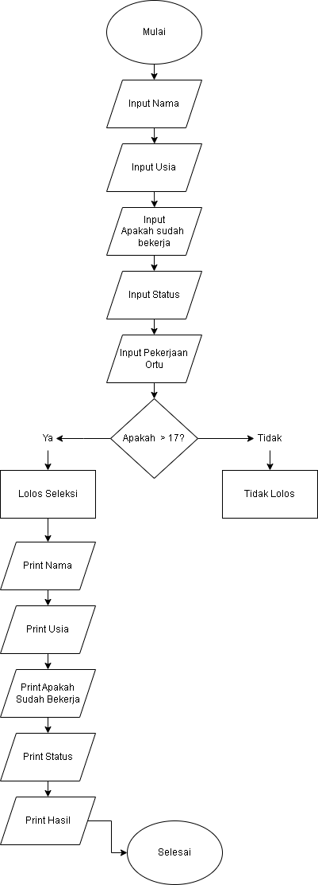

# Pendaftaran CPNS

## Deskripsi Program
Program Pendaftaran CPNS adalah program penginputan data untuk mengetahui hasil dari penginputan lolos atau tidak lolos

## Cara membuat program 
1. langkah awal yaitu dengan menginput : nama pendaftar,usia,apakah sudah bekerja,status dan pekerjaan orang tua.
2. langkah kedua yaitu masukan if  usia diatas 17 lolos seleksi dan else usia dibawah 17 tidak lolos.
3. langkah ketiga print semua dari inputan sampai if dan else nya

## Contoh Penggunaan
Pengguna bisa memasukan dengan nama,usia,status dan pekerjaan ortu kemudian enter, maka akan mucul hasil. 

## Kesimpulan
Program ini dibuat dengan tujuan untuk menginput data seleksi apakah lolos atau tidaknya imputan tersebut. Prpgram ini bisa lebih ditambahkan denga fitur tambahan dan lain-lainnya.

